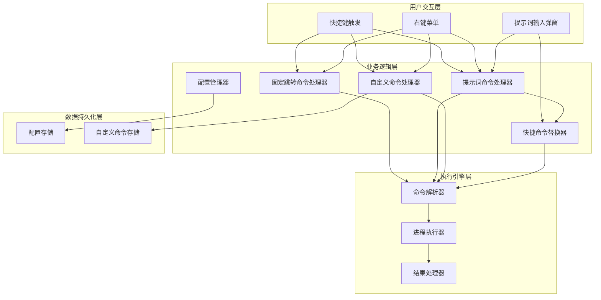
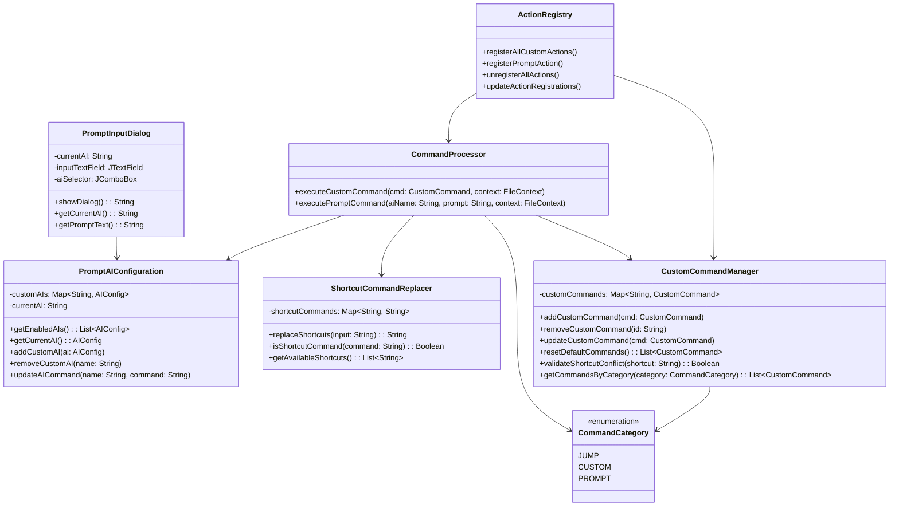
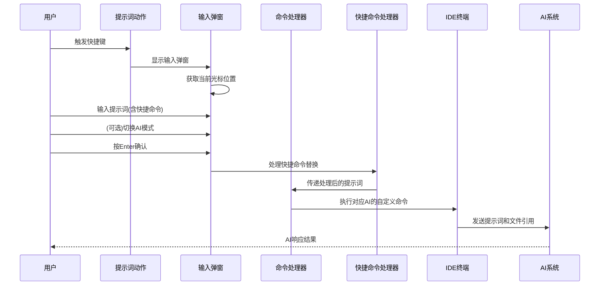
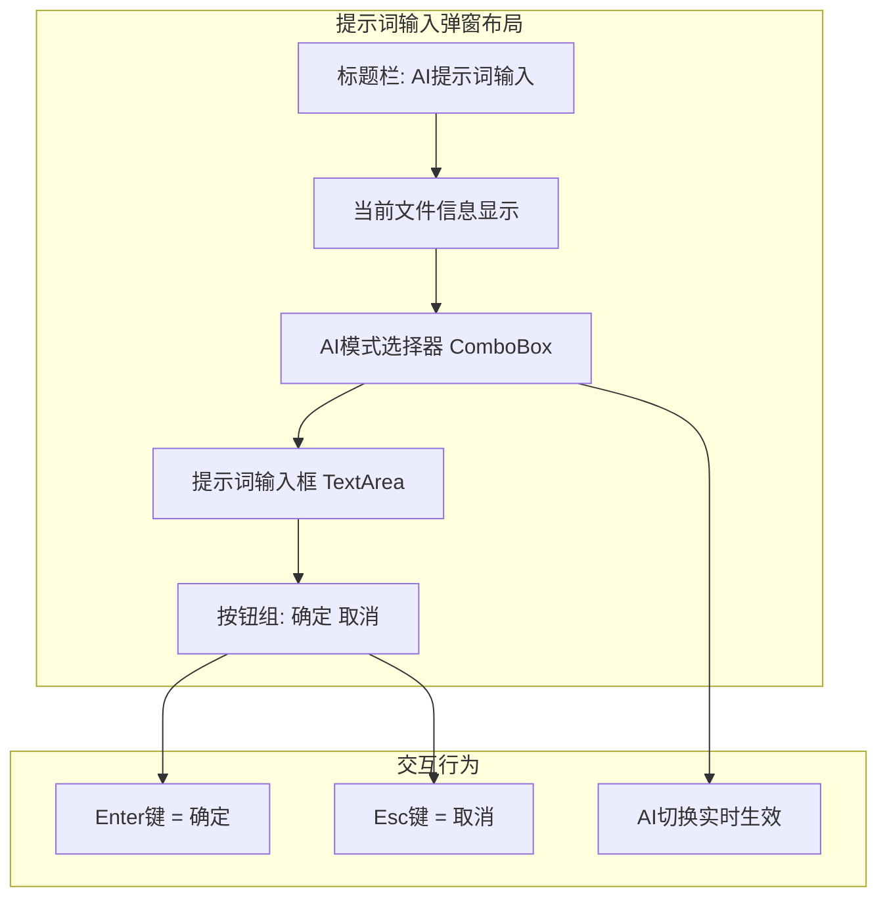
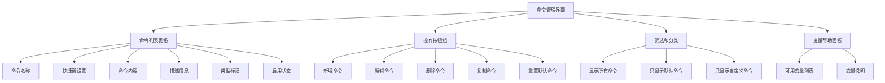
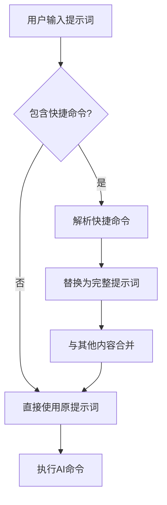
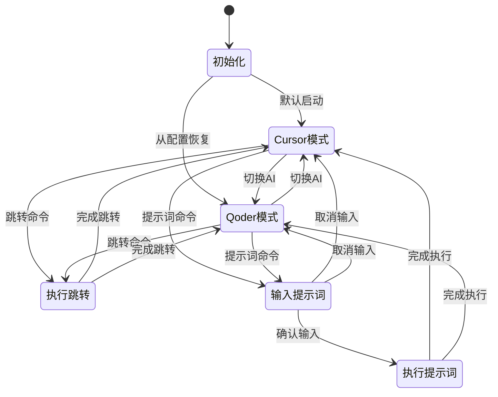

# AI模式切换和命令执行功能设计

## 概述

Switch2AI是一个IntelliJ IDEA插件，旨在简化开发者在JetBrains IDE与AI编辑器之间的切换体验。本设计文档描述了将原有复杂的多模式配置系统重构为两种简化操作模式的设计方案。

### 核心价值
- **操作简化**：从复杂的多模式配置简化为两种固定操作类型
- **快速切换**：支持快捷键和UI两种方式进行AI模式切换
- **智能执行**：根据当前AI模式智能执行对应的跳转或提示词命令

### 重构目标
- 简化配置复杂度，从多种AI模式配置简化为两种固定操作
- 提供更直观的提示词输入和执行体验
- 保持现有跳转功能的稳定性

## 技术架构

### 系统架构
本插件基于IntelliJ Platform SDK开发，采用分层架构模式，主要包含以下层次：



### 组件架构重构

#### 核心组件重新定义



## 功能设计

### 功能模块重构

#### 1. 跳转命令模块
跳转功能作为默认的自定义命令，用户可以修改、删除或新增：

| 默认命令 | 快捷键 | 命令模板 | 描述 | 操作 |
|---------|-------|---------|------|------|
| 跳转文件到Cursor | `Alt+Shift+1` | `open -a cursor cursor://file${filePath}:${line}:${column}` | 在Cursor中打开当前文件并定位 | 可修改/删除 |
| 跳转项目到Cursor | `Alt+Shift+2` | `open -a cursor ${projectPath}` | 在Cursor中打开整个项目 | 可修改/删除 |
| 跳转文件到Qoder | `Alt+Shift+3` | `open -a qoder qoder://file${filePath}:${line}:${column}` | 在Qoder中打开当前文件并定位 | 可修改/删除 |
| 跳转项目到Qoder | `Alt+Shift+4` | `open -a qoder ${projectPath}` | 在Qoder中打开整个项目 | 可修改/删除 |

**灵活性特点**：
- **可删除**：用户可以删除不需要的默认跳转命令
- **可修改**：可以修改快捷键、命令模板或描述
- **可扩展**：可以添加更多的跳转命令（如其他AI编辑器）
- **分类管理**：通过category字段区分跳转命令和自定义命令

#### 2. 提示词命令模块
新增提示词输入和执行功能，支持不同AI的自定义命令配置和快捷命令替换：



### 配置系统简化

#### 原配置结构 vs 新配置结构

**原配置结构**（复杂）：
```
aiList: {
  cursor: { name: "cursor", shortcut: "option+shift+1" }
  qoder: { name: "qoder", shortcut: "option+shift+2" }
  claudeCode: { name: "claudeCode", shortcut: "option+shift+3" }
}
actions: {
  switch2ai: { commands: { cursor: "cmd1", qoder: "cmd2", claudeCode: "cmd3" } }
  openFileInCursor: { commands: { cursor: "cmd4", qoder: "", claudeCode: "" } }
  openProjectInCursor: { commands: { cursor: "cmd5", qoder: "", claudeCode: "" } }
}
```

**新配置结构**（优化后）：
```
promptConfiguration: {
  currentAI: "cursor"
  customAIs: {
    "cursor": {
      name: "cursor"
      displayName: "Cursor AI"
      command: "cursor_ai_command --prompt '${prompt}' --file '${filePath}' --line ${line}"
      enabled: true
      isDefault: true
    }
    "qoder": {
      name: "qoder"
      displayName: "Qoder AI"
      command: "qoder_terminal_command '${prompt}' -f '${filePath}:${line}'"
      enabled: true
      isDefault: true
    }
    "claudeCode": {
      name: "claudeCode"
      displayName: "Claude Code"
      command: "claude_cli --prompt '${prompt}' --context '${filePath}:${line}:${column}'"
      enabled: true
      isDefault: true
    }
    // 用户可以添加更多自定义AI
    "chatgpt": {
      name: "chatgpt"
      displayName: "ChatGPT CLI"
      command: "chatgpt --file '${filePath}' --line ${line} --prompt '${prompt}'"
      enabled: false
      isDefault: false
    }
  }
}
shortcutCommands: {
  "$test": "请为这个函数编写单元测试，确保覆盖边界条件和异常情况"
  "$refactor": "请重构这段代码，提高可读性和性能，保持原有功能不变"
  "$explain": "请详细解释这段代码的功能和实现原理"
  "$optimize": "请优化这段代码的性能和内存使用"
  "$debug": "请帮我分析这段代码可能存在的bug和问题"
}
customCommands: {
  // 默认包含4个跳转命令，用户可以修改、删除或新增
  "jumpToCursorFile": {
    name: "跳转文件到Cursor"
    shortcut: "Alt+Shift+1"
    command: "open -a cursor cursor://file${filePath}:${line}:${column}"
    description: "在Cursor中打开当前文件并定位"
    category: "jump"  // 命令分类
    isDefault: true   // 标记为默认命令
  }
  "jumpToCursorProject": {
    name: "跳转项目到Cursor"
    shortcut: "Alt+Shift+2"
    command: "open -a cursor ${projectPath}"
    description: "在Cursor中打开当前项目"
    category: "jump"
    isDefault: true
  }
  "jumpToQoderFile": {
    name: "跳转文件到Qoder"
    shortcut: "Alt+Shift+3"
    command: "open -a qoder qoder://file${filePath}:${line}:${column}"
    description: "在Qoder中打开当前文件并定位"
    category: "jump"
    isDefault: true
  }
  "jumpToQoderProject": {
    name: "跳转项目到Qoder"
    shortcut: "Alt+Shift+4"
    command: "open -a qoder ${projectPath}"
    description: "在Qoder中打开当前项目"
    category: "jump"
    isDefault: true
  }
  // 用户可以添加更多自定义命令
  "myCustomAction1": {
    name: "自定义操作1"
    shortcut: "Ctrl+Alt+K"
    command: "echo 'Hello World'"
    description: "用户自定义的命令示例"
    category: "custom"
    isDefault: false
  }
}
```

### 用户界面设计

#### 提示词输入弹窗设计



弹窗UI布局：
- **标题栏**：显示"AI提示词输入"
- **文件信息**：显示当前文件路径和光标位置
- **AI选择器**：下拉框选择Cursor或Qoder
- **输入区域**：多行文本框输入提示词，支持快捷命令
- **快捷命令提示**：显示可用的快捷命令列表（$test、$refactor等）
- **操作按钮**：确定和取消按钮

#### 自定义AI配置功能设计

**灵活AI管理**：
- **默认AI**：系统预设3个AI（cursor、qoder、claudeCode）
- **自定义AI**：用户可以添加任意AI（如ChatGPT、Copilot等）
- **命令模板**：每个AI都有自定义的命令模板
- **启用状态**：可以灵活启用/禁用某个AI

#### 自定义命令功能设计

**统一命令管理理念**：
- **默认命令**：系统预设的4个跳转命令，标记为`isDefault: true`
- **用户命令**：用户自定义添加的命令，标记为`isDefault: false`
- **统一管理**：所有命令都在customCommands中，统一配置和管理

**功能特点**：
- **全面灵活性**：所有命令（包括默认跳转命令）都可以修改、删除
- **变量支持**：支持文件路径、项目路径、行号等变量替换
- **动态管理**：支持增加、删除、编辑任意命令
- **分类管理**：通过category字段对命令进行分类
- **快捷键冲突检测**：自动检测和防止快捷键冲突
- **默认命令保护**：提供重置默认命令的功能

**配置界面设计**：


**自定义命令示例**：

1. **打开终端在项目目录**
   ```json
   {
     "name": "打开终端",
     "shortcut": "Ctrl+Alt+T",
     "command": "osascript -e 'tell application \"Terminal\" to do script \"cd ${projectPath}\"'",
     "description": "在项目目录下打开终端"
   }
   ```

2. **用VS Code打开文件**
   ```json
   {
     "name": "VS Code打开文件",
     "shortcut": "Ctrl+Shift+V",
     "command": "code --goto ${filePath}:${line}:${column}",
     "description": "用VS Code打开当前文件并定位"
   }
   ```

3. **Git查看文件历史**
   ```json
   {
     "name": "Git文件历史",
     "shortcut": "Alt+G",
     "command": "git log --oneline -10 ${filePath}",
     "description": "查看当前文件的Git提交历史"
   }
   ```

#### 快捷命令功能设计

**快捷命令映射表**：
| 快捷命令 | 替换提示词 | 使用场景 |
|---------|------------|----------|
| `$test` | 请为这个函数编写单元测试，确保覆盖边界条件和异常情况 | 单元测试生成 |
| `$refactor` | 请重构这段代码，提高可读性和性能，保持原有功能不变 | 代码重构 |
| `$explain` | 请详细解释这段代码的功能和实现原理 | 代码解释 |
| `$optimize` | 请优化这段代码的性能和内存使用 | 性能优化 |
| `$debug` | 请帮我分析这段代码可能存在的bug和问题 | 调试分析 |
| `$doc` | 请为这段代码生成详细的文档注释 | 文档生成 |

**快捷命令处理流程**：


**示例使用场景**：
- 输入：`$test getCurrentUser方法`
- 替换后：`请为这个函数编写单元测试，确保覆盖边界条件和异常情况 getCurrentUser方法`
- 输入：`$refactor 这个循环太复杂了`
- 替换后：`请重构这段代码，提高可读性和性能，保持原有功能不变 这个循环太复杂了`

#### 状态栏组件优化

保持现有状态栏设计，显示当前AI模式，支持点击切换。

### 快捷键设计

#### 默认快捷键分配

| 功能 | 默认快捷键 | 描述 | 可修改 |
|-----|-------------|------|--------|
| 跳转文件到Cursor | `Alt+Shift+1` | 在Cursor中打开当前文件 | 是 |
| 跳转项目到Cursor | `Alt+Shift+2` | 在Cursor中打开当前项目 | 是 |
| 跳转文件到Qoder | `Alt+Shift+3` | 在Qoder中打开当前文件 | 是 |
| 跳转项目到Qoder | `Alt+Shift+4` | 在Qoder中打开当前项目 | 是 |
| 提示词输入 | `Alt+Shift+P` | 打开提示词输入弹窗 | 否 |

#### 用户自定义快捷键
支持用户完全自定义快捷键+命令的组合：

**配置特性**：
- **全面可定制**：包括默认跳转命令在内的所有快捷键都可修改
- **冲突检测**：系统自动检测并提醒快捷键冲突
- **灵活扩展**：用户可以添加无限多个自定义命令

**配置示例**：
```json
{
  "name": "打开终端",
  "shortcut": "Ctrl+Alt+T",
  "command": "osascript -e 'tell application \"Terminal\" to do script \"cd ${projectPath}\"'",
  "description": "在项目目录下打开终端"
}
```

**变量支持**：
- `${filePath}`: 当前文件路径
- `${projectPath}`: 当前项目路径
- `${line}`: 当前行号
- `${column}`: 当前列号
- `${selectedText}`: 选中的文本

## 数据模型重构

### 新增数据模型

```kotlin
// AI配置数据类
data class AIConfig(
    val name: String,                    // AI标识符（唯一）
    val displayName: String,             // 显示名称
    val command: String,                 // 命令模板
    val enabled: Boolean = true,         // 是否启用
    val isDefault: Boolean = false,      // 是否为默认AI
    val description: String = "",        // 描述信息
    val icon: String? = null             // 图标路径（可选）
)

// 命令分类枚举
enum class CommandCategory(val displayName: String) {
    JUMP("跳转命令"),
    CUSTOM("自定义命令"),
    PROMPT("提示词命令")
}

// 文件上下文信息
data class FileContext(
    val filePath: String,
    val projectPath: String,
    val line: Int,
    val column: Int,
    val selectedText: String? = null
)

// 统一的自定义命令配置
data class CustomCommand(
    val id: String,
    val name: String,
    val shortcut: String,
    val command: String,
    val description: String = "",
    val category: CommandCategory = CommandCategory.CUSTOM,
    val isDefault: Boolean = false,  // 标记是否为默认命令
    val enabled: Boolean = true
)

// 快捷命令处理器
class ShortcutCommandReplacer {
    private val shortcutCommands = mapOf(
        "$test" to "请为这个函数编写单元测试，确保覆盖边界条件和异常情况",
        "$refactor" to "请重构这段代码，提高可读性和性能，保持原有功能不变",
        "$explain" to "请详细解释这段代码的功能和实现原理",
        "$optimize" to "请优化这段代码的性能和内存使用",
        "$debug" to "请帮我分析这段代码可能存在的bug和问题",
        "$doc" to "请为这段代码生成详细的文档注释"
    )
    
    fun replaceShortcuts(input: String): String {
        var result = input
        shortcutCommands.forEach { (shortcut, replacement) ->
            if (result.contains(shortcut)) {
                result = result.replace(shortcut, replacement)
            }
        }
        return result
    }
    
    fun isShortcutCommand(command: String): Boolean {
        return shortcutCommands.keys.any { command.contains(it) }
    }
    
    fun getAvailableShortcuts(): List<String> {
        return shortcutCommands.keys.toList()
    }
}

// 统一配置数据结构
data class PluginConfiguration(
    // 提示词配置
    val promptConfiguration: PromptConfiguration = PromptConfiguration(),
    
    // 快捷命令映射
    val shortcutCommands: Map<String, String> = getDefaultShortcutCommands(),
    
    // 所有自定义命令(包括默认跳转命令)
    val customCommands: MutableMap<String, CustomCommand> = getDefaultCustomCommands().toMutableMap()
) {
    companion object {
        fun getDefaultCustomCommands() = mapOf(
            "jumpToCursorFile" to CustomCommand(
                id = "jumpToCursorFile",
                name = "跳转文件到Cursor",
                shortcut = "Alt+Shift+1",
                command = "open -a cursor cursor://file\${filePath}:\${line}:\${column}",
                description = "在Cursor中打开当前文件并定位",
                category = CommandCategory.JUMP,
                isDefault = true
            ),
            "jumpToCursorProject" to CustomCommand(
                id = "jumpToCursorProject",
                name = "跳转项目到Cursor",
                shortcut = "Alt+Shift+2",
                command = "open -a cursor \${projectPath}",
                description = "在Cursor中打开当前项目",
                category = CommandCategory.JUMP,
                isDefault = true
            ),
            "jumpToQoderFile" to CustomCommand(
                id = "jumpToQoderFile",
                name = "跳转文件到Qoder",
                shortcut = "Alt+Shift+3",
                command = "open -a qoder qoder://file\${filePath}:\${line}:\${column}",
                description = "在Qoder中打开当前文件并定位",
                category = CommandCategory.JUMP,
                isDefault = true
            ),
            "jumpToQoderProject" to CustomCommand(
                id = "jumpToQoderProject",
                name = "跳转项目到Qoder",
                shortcut = "Alt+Shift+4",
                command = "open -a qoder \${projectPath}",
                description = "在Qoder中打开当前项目",
                category = CommandCategory.JUMP,
                isDefault = true
            )
        )
        
        fun getDefaultShortcutCommands() = mapOf(
            "\$test" to "请为这个函数编写单元测试，确保覆盖边界条件和异常情况",
            "\$refactor" to "请重构这段代码，提高可读性和性能，保持原有功能不变",
            "\$explain" to "请详细解释这段代码的功能和实现原理",
            "\$optimize" to "请优化这段代码的性能和内存使用",
            "\$debug" to "请帮我分析这段代码可能存在的bug和问题",
            "\$doc" to "请为这段代码生成详细的文档注释"
        )
    }
}

// 提示词配置
data class PromptConfiguration(
    val currentAI: String = "cursor",
    val customAIs: MutableMap<String, AIConfig> = getDefaultAIs().toMutableMap()
) {
    companion object {
        fun getDefaultAIs() = mapOf(
            "cursor" to AIConfig(
                name = "cursor",
                displayName = "Cursor AI",
                command = "cursor_ai_command --prompt '\${prompt}' --file '\${filePath}' --line \${line}",
                enabled = true,
                isDefault = true,
                description = "Cursor AI编辑器的AI助手"
            ),
            "qoder" to AIConfig(
                name = "qoder",
                displayName = "Qoder AI", 
                command = "qoder_terminal_command '\${prompt}' -f '\${filePath}:\${line}'",
                enabled = true,
                isDefault = true,
                description = "Qoder AI编辑器的AI助手"
            ),
            "claudeCode" to AIConfig(
                name = "claudeCode",
                displayName = "Claude Code",
                command = "claude_cli --prompt '\${prompt}' --context '\${filePath}:\${line}:\${column}'",
                enabled = true,
                isDefault = true,
                description = "Claude AI的命令行工具"
            )
        )
    }
    
    // 获取已启用的AI列表
    fun getEnabledAIs(): List<AIConfig> {
        return customAIs.values.filter { it.enabled }
    }
    
    // 获取当前AI配置
    fun getCurrentAI(): AIConfig? {
        return customAIs[currentAI]
    }
    
    // 添加自定义AI
    fun addCustomAI(ai: AIConfig): Boolean {
        if (customAIs.containsKey(ai.name)) {
            return false // AI已存在
        }
        customAIs[ai.name] = ai
        return true
    }
    
    // 更新AI命令
    fun updateAICommand(name: String, command: String): Boolean {
        val ai = customAIs[name] ?: return false
        customAIs[name] = ai.copy(command = command)
        return true
    }
}
```

### 状态管理优化



## 实现流程

### 开发阶段规划

#### Phase 1: 核心重构
1. **简化配置模型**
   - 移除复杂的多AI配置
   - 实现AIMode枚举和简化配置
   - 重构ConfigurationManager

2. **重构命令处理器**
   - 简化CommandProcessor逻辑
   - 实现固定命令模板
   - 保持变量替换功能

#### Phase 2: 提示词功能
1. **提示词输入弹窗**
   - 实现PromptInputDialog组件
   - 集成文件上下文信息
   - 支持AI模式切换

2. **提示词命令执行**
   - 实现提示词命令处理逻辑
   - 集成IDE终端执行
   - 处理AI系统对接

#### Phase 3: 交互优化
1. **快捷键重新分配**
   - 注销旧的复杂快捷键
   - 注册新的简化快捷键
   - 更新右键菜单

2. **UI组件优化**
   - 优化状态栏显示
   - 完善错误提示
   - 改进用户体验

### 技术实现要点

#### 关键技术决策
1. **保持向后兼容**：现有跳转功能保持不变
2. **配置迁移**：提供配置从旧格式到新格式的迁移
3. **资源清理**：确保动态注册的动作和快捷键正确清理
4. **异常处理**：完善的错误处理和用户提示

#### 代码组织优化
```
src/main/kotlin/com/github/switch2ai/
├── core/
│   ├── models/          # 新增：数据模型
│   │   ├── PromptAIMode.kt
│   │   ├── CommandCategory.kt
│   │   └── FileContext.kt
│   ├── processors/      # 重构：命令处理器
│   │   ├── CommandProcessor.kt
│   │   ├── PromptCommandProcessor.kt
│   │   └── ShortcutCommandReplacer.kt
│   └── state/          # 现有：状态管理
├── ui/
│   ├── dialogs/        # 新增：对话框组件
│   │   └── PromptInputDialog.kt
│   └── statusbar/      # 现有：状态栏组件
├── actions/
│   ├── custom/         # 新增：统一的自定义动作
│   │   ├── CustomCommandAction.kt
│   │   └── PromptInputAction.kt
│   └── registry/       # 现有：动作注册
│       └── CustomActionRegistry.kt
├── config/            # 重构：配置管理
│   ├── PluginConfigurationManager.kt
│   ├── CustomCommandManager.kt      # 新增：自定义命令管理
│   └── settings/
│       ├── PluginSettingsState.kt
│       └── PluginSettingsConfigurable.kt
└── utils/             # 工具类模块
    └── VariableReplacer.kt
```

## 测试策略

### 单元测试覆盖
- **配置管理测试**：验证配置优化和迁移逻辑
- **命令处理测试**：验证跳转和提示词命令的正确处理
- **快捷命令测试**：验证快捷命令的替换逻辑和正确性
- **UI组件测试**：验证提示词输入弹窗的交互逻辑
- **状态管理测试**：验证AI模式切换的状态一致性

### 集成测试场景
- **跳转功能测试**：验证到Cursor和Qoder的跳转功能
- **提示词功能测试**：验证提示词输入和执行流程
- **快捷命令集成测试**：验证快捷命令在完整流程中的正确处理
- **不同AI命令测试**：验证不同AI模式下的自定义命令执行
- **快捷键测试**：验证所有快捷键的正确响应
- **配置持久化测试**：验证配置的保存和恢复

### 用户验收测试
- **操作流畅性**：验证优化后的操作流程更加直观
- **快捷命令体验**：验证快捷命令的易用性和效率提升
- **多种AI支持**：验证不同AI模式下的功能完整性
- **功能完整性**：确保重构后功能不丢失
- **性能表现**：验证响应速度和资源占用
- **兼容性测试**：验证在不同IDE版本下的兼容性